# MarketPeak_Ecommerce

Steps taken to deploy the entire flow of the project:

1. Created MarketPeak_Ecommerce directory and initialized Git Repository
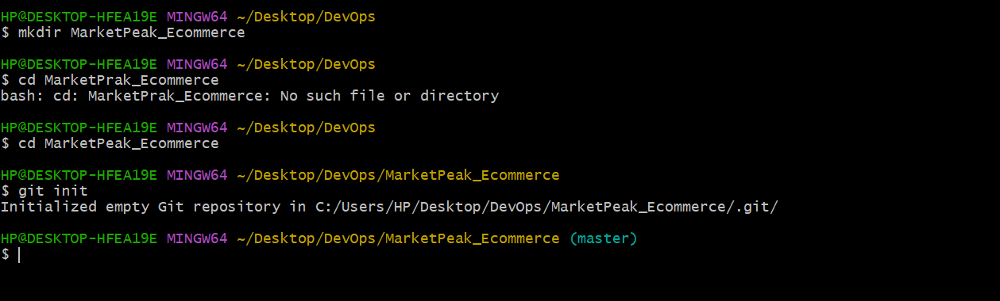

2. Obtained and prepared the E-commerce website template. Extracted the downloaded template into the MarketPeak_Ecommerce directory.

3. Staged and commit the template to Git
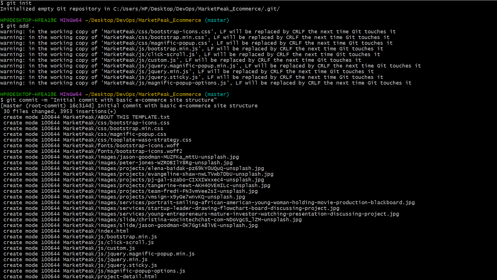

4. Pushed the code to my GitHub repository.
Created a remote repository on GitHub
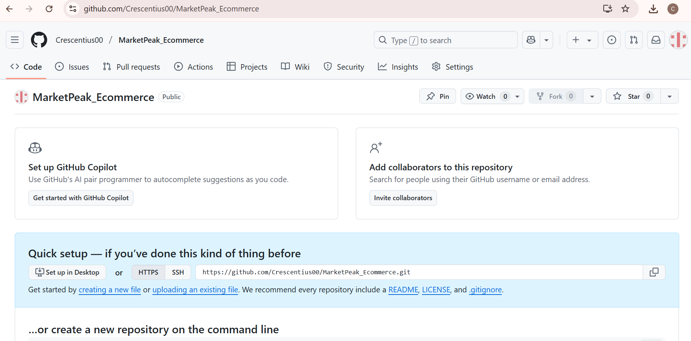

Linked the local repository to GitHub using git remote add command
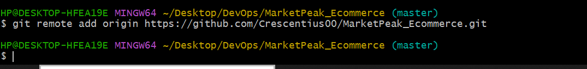

Uploaded the local repository to GitHub using git push -u command.
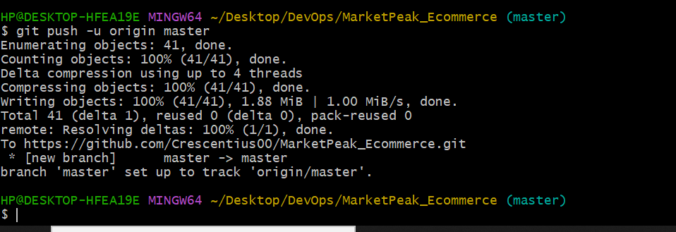

5. Set up AWS EC2 instance.
Logged in to AWS management console and launched an EC2 instance using Amazon Linux AMI.
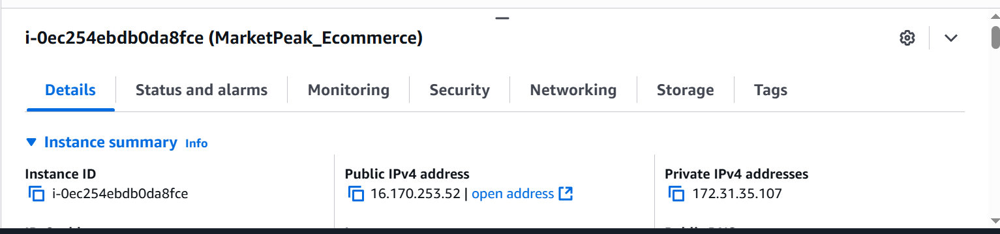

Connected to the instance using ssh
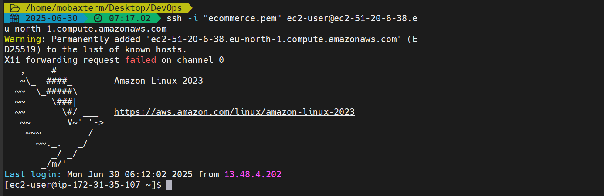

6. Clone the GitHub repository to the AWS instance.
Generated ssh keypair using ssh-keygen
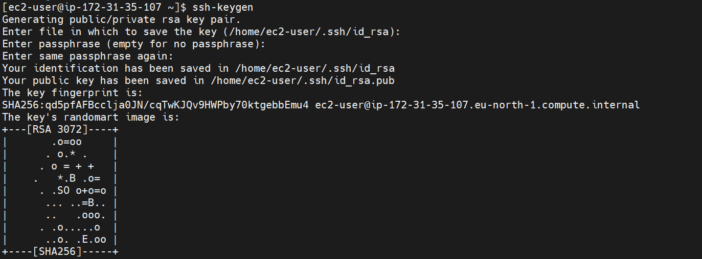

Added ssh public keypair using ssh-keygen
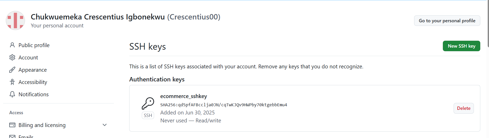

Error Encountered: (-bash: git:command not found). I encountered this error so I had to install Git in my EC2 instance using yum command.
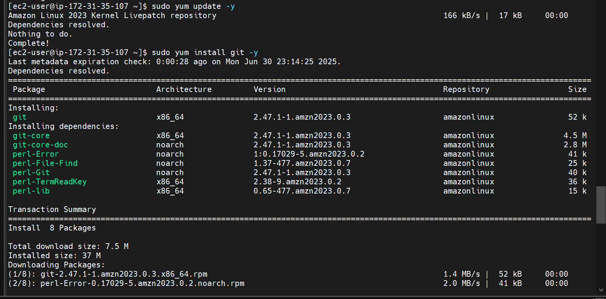

7. Installes Apache web server
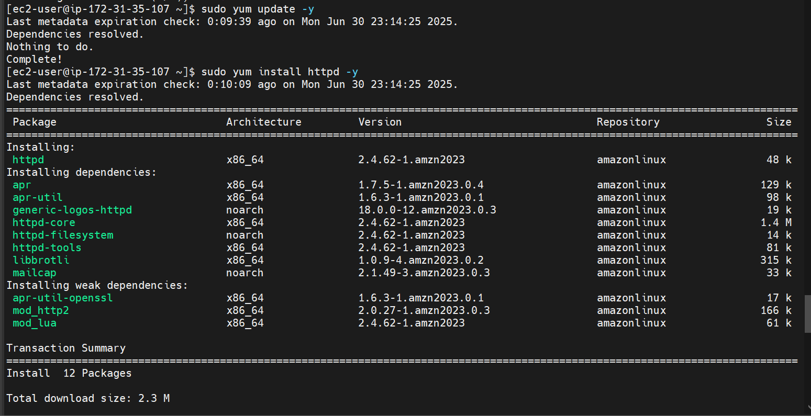

Then I started and enabled Apache
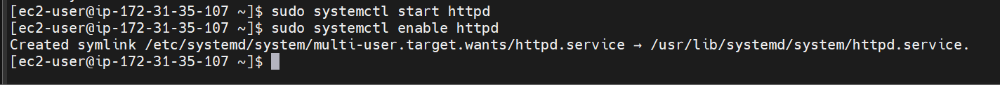

8. Configured httpd for the website, and cleared the default httpd web directory /var/www/html/
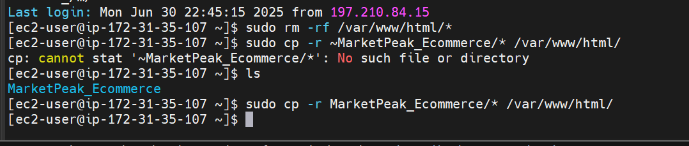

Then I copied MarketPeak_Ecommerce to the httpd web directory.

Finally I reloaded httpd and tested the website using the EC2 public ip address.